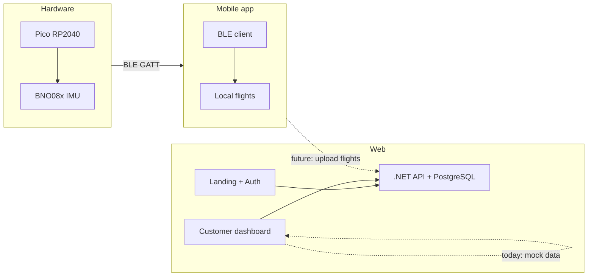
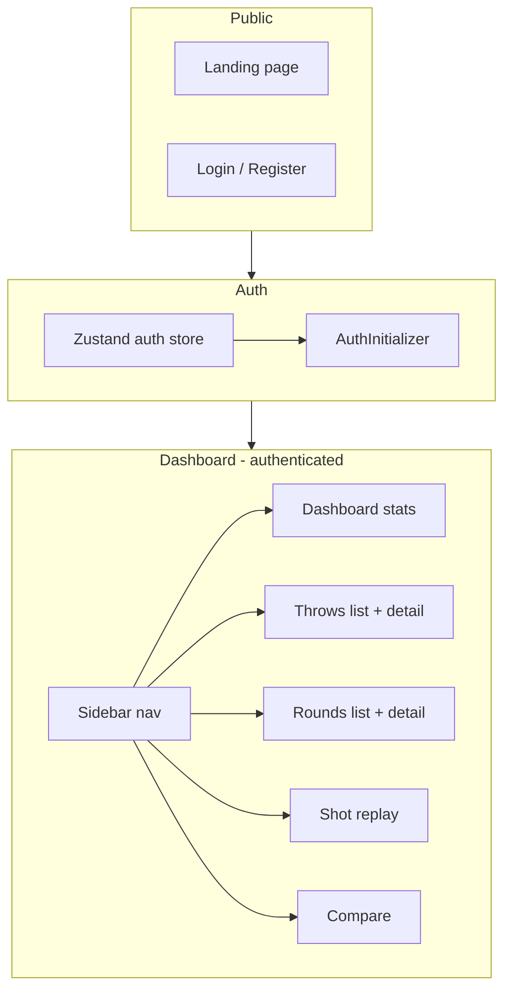

# DiscDawg architecture

This document describes the full DiscDawg system from hardware through mobile to web, and what was built during development.

---

## 1. Product overview

**What DiscDawg is:** A puck that attaches to a disc, records flight via an IMU (and planned GNSS), syncs to your phone over Bluetooth Low Energy, and is supported by a web app for marketing and a logged-in customer dashboard.

- **Tagline:** *Flight data for your disc.*  
- **Alternate tagline:** *Know your throw.*  
- **One-liner:** DiscDawg is a small puck that attaches to your disc. It tracks flight data—speed, hyzer, anhyzer, distance—and syncs to your phone so you can track your stats and improve your game.

Branding details (voice, value props, key messages) live in [client/web/BRANDING.md](../client/web/BRANDING.md).

---

## 2. High-level architecture

- **Hardware:** Pico + IMU detect throw/land, log orientation (r, p, y) at ~50 Hz, store `flight.json`, advertise BLE as “DiscDawg”.
- **Mobile:** Scans for DiscDawg, connects, transfers flight JSON (chunked), stores flights locally. Supports “mock” or “live” (BLE) mode.
- **Web:** Public landing + login/register + customer dashboard (stats, throws, rounds, replay, compare). Backend: .NET API + PostgreSQL for users/auth. Dashboard data is **mock** today; data layer is set up to swap to a live API later.

---

## 3. Hardware / embedded

- **Stack:** Raspberry Pi Pico (RP2040), MicroPython, BNO08x over I2C.
- **Location:** [embedded/](../embedded/) — main entry [embedded/main.py](../embedded/main.py).

**Behavior:**

- **Throw detection:** Accel magnitude above threshold → start logging.
- **Land detection:** Accel below threshold for `LAND_TIMEOUT` → stop logging, save to `flight.json`, expose payload via BLE.
- **Logged data:** Time-series of `{ t, r, p, y }` (time in ms, roll/pitch/yaw in degrees). Accel is used only for throw/land detection; it is not stored in samples.

**BLE:** GATT server with custom service/characteristics. Chunked transfer for large flight JSON. Commands (e.g. clear, mock) via control characteristic; flight data read + status/monitor notify. UUIDs and chunk size in [embedded/main.py](../embedded/main.py).

**Planned:** GNSS for position/time is not implemented yet; it is on the roadmap for 3D flight path and true distance.

---

## 4. Mobile app

- **Stack:** React Native / Expo, TypeScript. BLE via react-native-ble-plx.
- **Location:** [mobile/](../mobile/).

**Screens:** Flight list, Scan (for DiscDawg), Flight detail, Live monitor (real-time IMU). Data mode: “mock” vs “live” (BLE).

**Data:** [mobile/src/types/index.ts](../mobile/src/types/index.ts) — `Flight` (id, discName, recordedAt, duration, samples, synced), `FlightSample` (t, r, p, y). Matches Pico payload shape.

**Flow:** Scan for device named “DiscDawg” → connect → read flight (chunked) → parse JSON → store locally; list and detail screens show flights and orientation samples.

---

## 5. Web – backend

- **Stack:** .NET 8, PostgreSQL, Entity Framework Core, JWT (access + refresh), BCrypt.
- **Location:** [client/BackendApi/](../client/BackendApi/).

**Purpose:** User registration, login, refresh, get/update current user. There is no “flights” or “throws” API yet; the dashboard uses mock data.

**Reference:** [client/README.md](../client/README.md) for run commands, environment variables, and API endpoints (e.g. `POST /auth/register`, `POST /auth/login`, `GET /user`).

---

## 6. Web – frontend

- **Stack:** Next.js 15, React 19, TypeScript, Tailwind 4, TanStack Query, Zustand. Shadcn-style UI under [client/web/src/components/ui/](../client/web/src/components/ui/).
- **Location:** [client/web/](../client/web/).

**Public (unauthenticated):**

- **Landing** [client/web/src/app/page.tsx](../client/web/src/app/page.tsx): Hero (logo + “Know your throw”), value props, how it works, why it matters, waitlist (email + mailto), sticky CTA bar, scroll fade-in (FadeInSection). OG/Twitter meta, smooth scroll.
- **Branding:** [client/web/BRANDING.md](../client/web/BRANDING.md); [client/web/public/assets/](../client/web/public/assets/) for logo (used in header and hero).

**Auth:** Login/register pages; auth state in Zustand ([shared/stores/authStore.ts](../client/web/shared/stores/authStore.ts)) with persistence. [AuthInitializer](../client/web/src/components/AuthInitializer.tsx) clears loading and validates token on load. Header shows Login or user + Dashboard/Logout; loading state is cleared so the header does not stay stuck on “Loading…”.

**Dashboard (authenticated):**

- Layout with sidebar [client/web/src/components/dashboard/DashboardSidebar.tsx](../client/web/src/components/dashboard/DashboardSidebar.tsx): Dashboard, Throws, Rounds, Shot replay, Compare.
- **Dashboard (home):** Stats cards (total throws, top speed, max distance, sessions), averages, release angle mix, release quality card, “throws this week” bars, recent throws table. All mock.
- **Throws:** List from `useThrows()`; rows link to **Throw detail** [client/web/src/app/dashboard/throws/[id]/page.tsx](../client/web/src/app/dashboard/throws/[id]/page.tsx): summary + orientation-over-time chart (roll, pitch, yaw).
- **Rounds:** List from `useRounds()`; round detail shows throws in that round (mock).
- **Shot replay:** Select a throw → orientation chart; copy notes 3D path when GNSS is available.
- **Compare:** Select two throws → side-by-side stats + orientation charts.

**Data layer:** Types in [client/web/src/app/dashboard/types.ts](../client/web/src/app/dashboard/types.ts) (Throw, Round, FlightSample, ReleaseQuality). Mock in [client/web/src/app/dashboard/data/mockData.ts](../client/web/src/app/dashboard/data/mockData.ts); hooks in [client/web/src/app/dashboard/data/hooks.ts](../client/web/src/app/dashboard/data/hooks.ts) (`useThrows`, `useThrow`, `useRounds`, `useRound`, `useReleaseQuality`). [client/web/src/app/dashboard/data/README.md](../client/web/src/app/dashboard/data/README.md) explains how to swap to a live API without changing the UI.

---

## 7. Data flow (current and intended)

**Current:**

- Pico → BLE → mobile (flight JSON); mobile stores flights locally.
- Web dashboard reads **mock** data only; web auth is live (login/register/refresh against .NET).

**Intended (when backend has flights):**

- Mobile (or a future sync job) uploads flights to the API.
- Web dashboard hooks call the API instead of mock data so the same UI shows real throws, rounds, and replay.

---

## 8. What was added during development (summary)

- **Landing page:** Hero, features, how it works, waitlist form, trust line, sticky CTA, FadeInSection, OG/Twitter meta, smooth scroll.
- **BRANDING.md** and **public/assets** (logo); header and hero use logo with text fallback.
- **Customer dashboard:** Sidebar; Dashboard (stats + release quality); Throws (list + detail with orientation chart); Rounds (list + detail); Shot replay (select throw + chart); Compare (two throws side-by-side).
- **Dashboard data layer:** Types, mock data, hooks, and README for easy API swap.
- **OrientationChart** component: SVG chart of roll, pitch, yaw over time.
- **Auth:** Initial loading state and AuthInitializer updated so the header does not stay on “Loading…” and the rest of the page (including Login) renders correctly.
